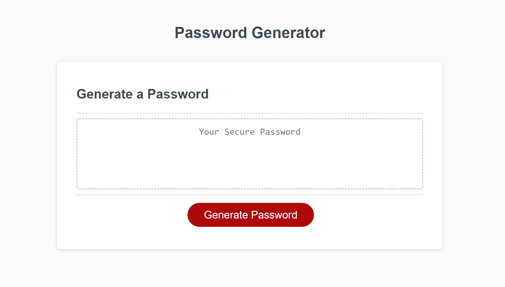

# JS-Password-Generator

## Description

The purpose of this project was to refactor given code to implement a password generator created through JavaScript programming.

## Screenshot

## Usage

Click on the "Generate Password" button to launch a set of prompts to create your password. Choose a password length between 8 and 128 characters, and choose the type of characters you want in your password.

## Credits

N/A

## Link

https://nnamdionyeije.github.io/JS-Password-Generator/
